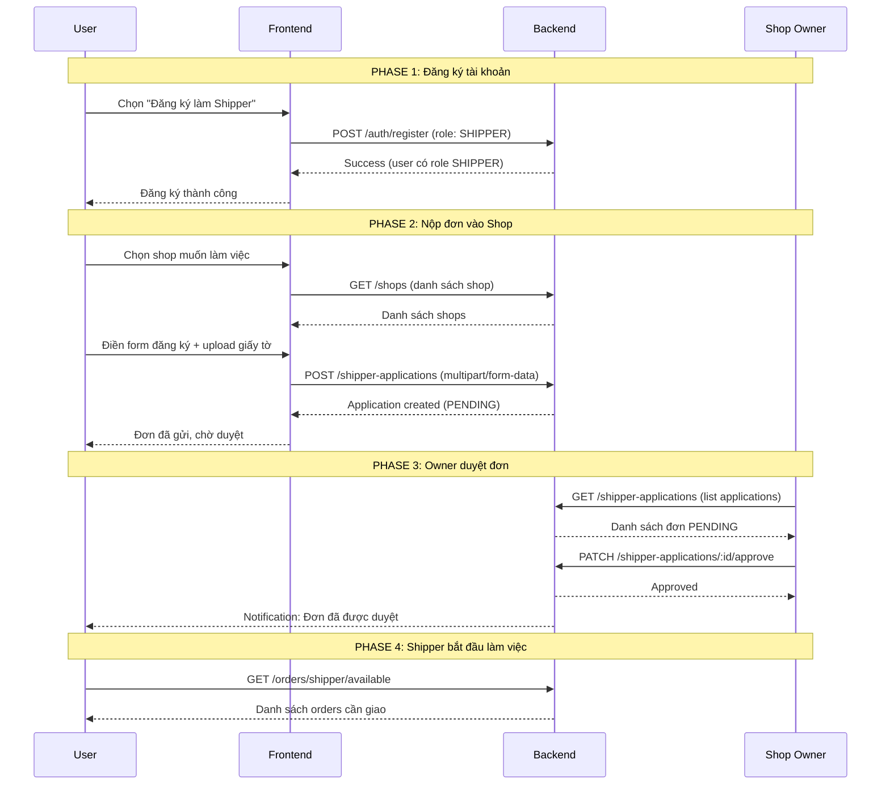

# Shipper Registration Flow - Hướng Dẫn Đăng Ký Shipper

> **Cập nhật**: 28/01/2026  
> **Phiên bản**: 1.0

## Tổng Quan

Tài liệu này mô tả quy trình đăng ký làm Shipper trong hệ thống KTX Delivery App, bao gồm:

- Đăng ký tài khoản với role SHIPPER
- Nộp đơn xin làm shipper cho một shop
- Quy trình duyệt đơn bởi Owner

## Flow Diagram



## Chi Tiết Các Bước

### 1. Đăng Ký Tài Khoản

**Endpoint**: `POST /api/auth/register`

```json
{
  "email": "shipper@example.com",
  "password": "matkhau123",
  "displayName": "Nguyễn Văn A",
  "phone": "0901234567",
  "role": "SHIPPER" // ⭐ Quan trọng: chọn SHIPPER
}
```

**Response**:

```json
{
  "success": true,
  "data": {
    "user": {
      "id": "abc123",
      "email": "shipper@example.com",
      "role": "SHIPPER",
      "status": "ACTIVE"
    }
  }
}
```

> **Lưu ý**: Sau bước này, user đã có role SHIPPER nhưng **chưa được gán vào shop nào**.

---

### 2. Chọn Shop & Nộp Đơn

#### 2.1 Lấy danh sách shops

**Endpoint**: `GET /api/shops`

```json
{
  "success": true,
  "data": {
    "shops": [
      {
        "id": "nzIfau9GtqIPyWkmLyku",
        "name": "Hiệp Thập Cẩm",
        "address": "Tòa B5"
      }
    ]
  }
}
```

#### 2.2 Nộp đơn xin làm shipper

**Endpoint**: `POST /api/shipper-applications`  
**Content-Type**: `multipart/form-data`  
**Authorization**: `Bearer <idToken>`

| Field           | Type   | Required | Description                           |
| --------------- | ------ | -------- | ------------------------------------- |
| `shopId`        | string | ✅       | ID của shop muốn làm việc             |
| `vehicleType`   | enum   | ✅       | `MOTORBIKE`, `BICYCLE`, `WALKING`     |
| `vehicleNumber` | string | ✅       | Biển số xe (VD: 59A1-12345)           |
| `idCardNumber`  | string | ✅       | Số CCCD (12 số)                       |
| `idCardFront`   | file   | ✅       | Ảnh CCCD mặt trước (JPG/PNG, max 5MB) |
| `idCardBack`    | file   | ✅       | Ảnh CCCD mặt sau (JPG/PNG, max 5MB)   |
| `driverLicense` | file   | ✅       | Ảnh Bằng lái xe (JPG/PNG, max 5MB)    |
| `message`       | string | ❌       | Lời nhắn cho chủ shop                 |

**Ví dụ với curl**:

```bash
curl -X POST "http://localhost:3000/api/shipper-applications" \
  -H "Authorization: Bearer <token>" \
  -F "shopId=nzIfau9GtqIPyWkmLyku" \
  -F "vehicleType=MOTORBIKE" \
  -F "vehicleNumber=59A1-12345" \
  -F "idCardNumber=012345678901" \
  -F "message=Toi muon lam shipper" \
  -F "idCardFront=@cccd_truoc.jpg" \
  -F "idCardBack=@cccd_sau.jpg" \
  -F "driverLicense=@banglai.jpg"
```

**Response Success**:

```json
{
  "success": true,
  "data": {
    "id": "sBpkNUl0hd4mMGAaWxh5",
    "userId": "5H2rTxQNFpgRaBZ6X0KVdZkFqSw1",
    "userName": "Nguyễn Văn A",
    "shopId": "nzIfau9GtqIPyWkmLyku",
    "shopName": "Hiệp Thập Cẩm",
    "vehicleType": "MOTORBIKE",
    "vehicleNumber": "59A1-12345",
    "status": "PENDING",
    "createdAt": "2026-01-28T12:26:47.524Z"
  }
}
```

---

### 3. Xem Trạng Thái Đơn

**Endpoint**: `GET /api/shipper-applications/me`

```json
{
  "success": true,
  "data": [
    {
      "id": "sBpkNUl0hd4mMGAaWxh5",
      "shopName": "Hiệp Thập Cẩm",
      "status": "PENDING", // PENDING | APPROVED | REJECTED
      "createdAt": "2026-01-28T12:26:47.524Z"
    }
  ]
}
```

---

### 4. Quy Trình Duyệt (Owner)

#### 4.1 Xem danh sách đơn

**Endpoint**: `GET /api/shipper-applications` (Owner only)

#### 4.2 Duyệt đơn

**Endpoint**: `PATCH /api/shipper-applications/:id/approve`

Khi duyệt đơn:

- User's `shipperInfo.shopId` được set
- User's `shipperInfo.status` = `AVAILABLE`
- Firebase Custom Claims được update

#### 4.3 Từ chối đơn

**Endpoint**: `PATCH /api/shipper-applications/:id/reject`

```json
{
  "reason": "Thiếu bằng lái xe"
}
```

---

## Error Codes

| Code          | Message                            | Giải thích                                          |
| ------------- | ---------------------------------- | --------------------------------------------------- |
| `SHIPPER_001` | Bạn đã là shipper của một shop rồi | User đã được gán vào shop (có `shipperInfo.shopId`) |
| `SHIPPER_005` | Bạn đã nộp đơn cho shop này rồi    | Đã có đơn PENDING cho shop này                      |

---

## Lưu Ý Quan Trọng

### ⚠️ Role vs Shop Assignment

```
┌──────────────────────────────────────────────────────────┐
│  role: "SHIPPER"                                         │
│  ↓                                                       │
│  Có thể truy cập các API dành cho shipper               │
│  NHƯNG chưa được gán vào shop nào                       │
│                                                          │
│  shipperInfo.shopId = null → CẦN NỘP ĐƠN               │
│  shipperInfo.shopId = "xxx" → ĐÃ ĐƯỢC DUYỆT            │
└──────────────────────────────────────────────────────────┘
```

### Frontend Logic

```javascript
// Kiểm tra trạng thái shipper
async function checkShipperStatus(user) {
  if (user.role !== "SHIPPER") {
    return "NOT_SHIPPER";
  }

  if (user.shipperInfo?.shopId) {
    return "ACTIVE_SHIPPER"; // Đã được duyệt, có thể nhận đơn
  }

  // Kiểm tra có đơn đang chờ không
  const applications = await api.get("/shipper-applications/me");
  const pending = applications.find((a) => a.status === "PENDING");

  if (pending) {
    return "PENDING_APPLICATION"; // Đang chờ duyệt
  }

  return "NEED_TO_APPLY"; // Cần nộp đơn
}
```

---

## Test Results

### ✅ Test Case 1: User SHIPPER apply vào shop

**Input**:

- User với role `SHIPPER`, chưa có `shipperInfo.shopId`
- Nộp đơn vào shop "Hiệp Thập Cẩm"

**Result**: ✅ **PASSED**

```json
{
  "success": true,
  "data": {
    "id": "sBpkNUl0hd4mMGAaWxh5",
    "status": "PENDING"
  }
}
```

### ✅ Test Case 2: User apply lần 2 (duplicate)

**Input**: User nộp đơn lần 2 vào cùng shop

**Result**: ✅ **PASSED** (Bị reject đúng)

```json
{
  "success": false,
  "message": "SHIPPER_005: Bạn đã nộp đơn cho shop này rồi"
}
```

### ✅ Test Case 3: Xem danh sách applications

**Result**: ✅ **PASSED**

- Trả về đúng application với status PENDING

---

## API Summary

| Method | Endpoint                            | Role    | Description              |
| ------ | ----------------------------------- | ------- | ------------------------ |
| POST   | `/auth/register`                    | Public  | Đăng ký với role SHIPPER |
| GET    | `/shops`                            | Public  | Lấy danh sách shops      |
| POST   | `/shipper-applications`             | SHIPPER | Nộp đơn xin làm shipper  |
| GET    | `/shipper-applications/me`          | SHIPPER | Xem đơn của mình         |
| DELETE | `/shipper-applications/:id`         | SHIPPER | Hủy đơn PENDING          |
| GET    | `/shipper-applications`             | OWNER   | Xem đơn của shop         |
| PATCH  | `/shipper-applications/:id/approve` | OWNER   | Duyệt đơn                |
| PATCH  | `/shipper-applications/:id/reject`  | OWNER   | Từ chối đơn              |

## Gợi ý flow UI

[Đăng ký Shipper]
↓
[Chọn Shop để apply]
↓
[Điền thông tin: CCCD, biển số xe...]
↓
[Submit Application] → Thành công
↓
[Màn hình "Chờ duyệt"] ← ⏳ SHIPPER Ở ĐÂY
↓
(Owner duyệt)
↓
[Shipper Home - Xem đơn hàng] ← MỚI ĐƯỢC VÀO ĐÂY
