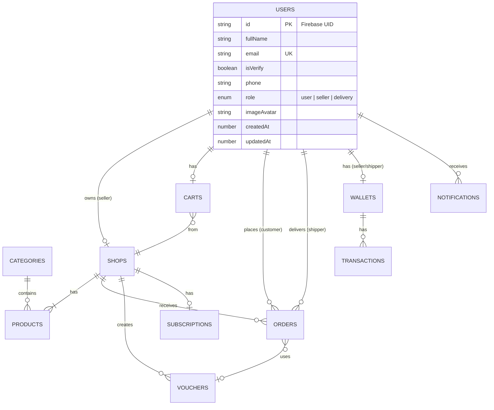

# ER Diagram - KTX Delivery

```mermaid
erDiagram
    %% ========================================
    %% ✅ DONE - Äã implement
    %% ========================================

    USERS {
        string id PK "Firebase UID"
        string fullName
        string email UK
        boolean isVerify
        string phone
        enum role "user | seller | delivery"
        string imageAvatar
        number createdAt
        number updatedAt
    }

    %% ========================================
    %% 🔲 PLANNED - Chưa implement
    %% ========================================

    CATEGORIES 

    SHOPS

    PRODUCTS

    CARTS

    ORDERS

    VOUCHERS

    TRANSACTIONS

    NOTIFICATIONS

    SUBSCRIPTIONS

    %% ========================================
    %% RELATIONSHIPS
    %% ========================================

    %% User relationships
    USERS ||--o| SHOPS : "owns (seller)"
    USERS ||--o| CARTS : "has"
    USERS ||--o{ ORDERS : "places (customer)"
    USERS ||--o{ ORDERS : "delivers (shipper)"
    USERS ||--o| WALLETS : "has (seller/shipper)"
    USERS ||--o{ NOTIFICATIONS : "receives"

    %% Shop relationships
    SHOPS ||--|{ PRODUCTS : "has"
    SHOPS ||--o{ ORDERS : "receives"
    SHOPS ||--o{ VOUCHERS : "creates"
    SHOPS ||--o| SUBSCRIPTIONS : "has"

    %% Product relationships
    CATEGORIES ||--o{ PRODUCTS : "contains"

    %% Cart relationships
    CARTS }o--|| SHOPS : "from"

    %% Order relationships
    ORDERS }o--o| VOUCHERS : "uses"

    %% Wallet relationships
    WALLETS ||--o{ TRANSACTIONS : "has"
```

---

## Legend

| Status | Meaning        |
| ------ | -------------- |
| ✅     | Äã implement   |
| 🔲     | Chưa implement |

---

## Implementation Progress

| Collection    | Backend | Frontend |
| ------------- | ------- | -------- |
| USERS         | ✅ Done | 🔲       |
| CATEGORIES    | 🔲      | 🔲       |
| SHOPS         | 🔲      | 🔲       |
| PRODUCTS      | 🔲      | 🔲       |
| CARTS         | 🔲      | 🔲       |
| ORDERS        | 🔲      | 🔲       |
| VOUCHERS      | 🔲      | 🔲       |
| WALLETS       | 🔲      | 🔲       |
| TRANSACTIONS  | 🔲      | 🔲       |
| NOTIFICATIONS | 🔲      | 🔲       |
| SUBSCRIPTIONS | 🔲      | 🔲       |
